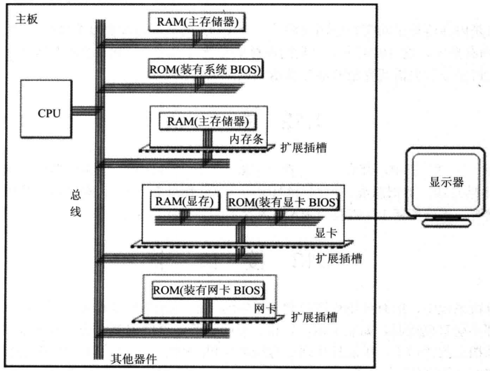
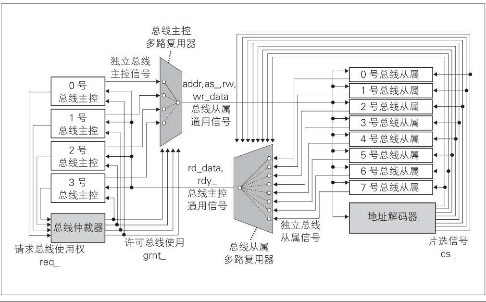

## 总线
计算机能处理的信息都是电信号，电信号当然需要导线送。连接cpu和其它芯片的导线称为 **总线**。
物理上讲总线就是一根根导线的集合。根据传送的信息不同，总线逻辑上分为：地址总线，控制总线，数据总线。

1. 地址总线

    一根导线可以传送的稳定状态只有两种。所以地址总线的宽度决定了cpu寻址能力。eg：32位操作系统 有32根地址总线最大寻址2**32 4G
2. 数据总线
    数据总线的宽度决定了CPU与外界数据传输速度。eg：8 根导线一次可以传送8位二进制（一个字节），16根数据总线可以传送两个字节。
 
3. 控制总线
    有多少控制总线意味cpu提供对外部器件多少种控制。决定了对外部器件控制能力。 
   

## 总线内部结构
1.早期总线的内部结构

   它实际上是处理器芯片引脚的延伸，是处理器与I/O设备适配器的通道。这种简单的总线一般由50—100条线组成，这些线按其功能可分为三类：地址线、数据线和控制线。
简单总线结构的不足之处在于：
第一　CPU是总线上的唯一主控者。
第二　总线信号是CPU引脚信号的延伸，故总线结构紧密与CPU相关，通用性较差。

2.当代流行的总线内部结构它是一些标准总线

追求与结构、CPU、技术无关的开发标准，并满足包括多个CPU在内的主控者环境需求。
在当代总线结构中，CPU和它私有的cache一起作为一个模块与总线相连。系统中允许有多个这样的处理器模块。而总线控制器完成几个总线请求者之间的协调与仲裁。
整个总线分成如下四部分：
1.数据传送总线：由地址线、数据线、控制线组成。
2.仲裁总线：包括总线请求线和总线授权线。
3.中断和同步总线：用于处理带优先级的中断操作，包括中断请求线和中断认可线。
4.公用线;包括时钟信号线、电源线、地线、系统复位线以及加电或断电的时序信号线等。

## 总线模块的组成

|  文件   | 说明  |
|  ----  | ----  |
| bus  | 总线顶层模块 |
| arbiter  | 总线仲裁器 |
| addr_dec | 地址解码器 |
| master_mux | 总线主控多路复用 |
| slave_mux | 总线从属夺路复用 |
 

